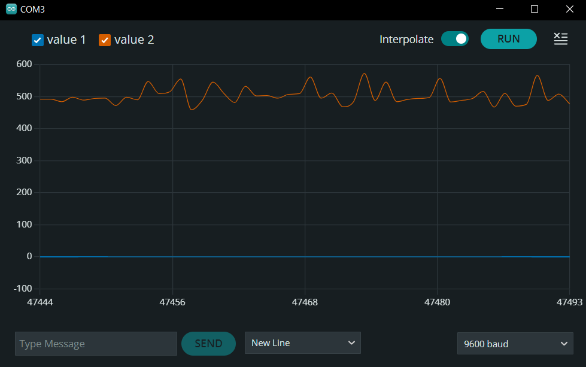

# Sound detection

*"A good bell is heard from afar, a bad one still further"*

While this might be true for bells and us humans, this proverb fell on deaf ears when it comes to sound detection.

This project demonstrates a basic circuit using a microphone and OP-amp alongside few passive components and as such can be used as the basis for frequency analysis and all sorts of sound detection projects.

## Headers

# This is a Heading h1
## This is a Heading h2

The very mention of sound detection implies usage of microphones, types of transducers which convert sound to electric signal. Not only is the output signal very weak even for nearby sources of sound, but it also contains noise. For this reason the LM386 amplifier is conected to the mic with electrolytic capacitors which filter out unwanted noise. The schematic below shows one way of achieving amplification of filtered signal.


Capacitor C2 is added to further increase the amplification of the signal. This is more-or-less neccessary for any practical use.

Below is a simple code used to display the signal, along with a plotted output. Despite all the capacitors the noise is still present! Or maybe it's just the voices in my walls, who knows.

```c
void setup() {

  Serial.begin(9600);
}

void loop() {
  //int a0 = analogRead(A0);
  int a1 = analogRead(A1);
  Serial.print(0);
  //Serial.print(",");
  //Serial.println(a0);
  Serial.print(",");
  Serial.println(a1);
  delay(1);
}
```
###### This is a Heading h6

## Emphasis

*This text will be italic*  
_This will also be italic_

**This text will be bold**  
__This will also be bold__

_You **can** combine them_

## Lists

### Unordered

* Item 1
* Item 2
* Item 2a
* Item 2b

### Ordered

1. Item 1
2. Item 2
3. Item 3
    1. Item 3a
    2. Item 3b

## Images



## Links

You may be using [Markdown Live Preview](https://markdownlivepreview.com/).

## Blockquotes

> Markdown is a lightweight markup language with plain-text-formatting syntax, created in 2004 by John Gruber with Aaron Swartz.
>
>> Markdown is often used to format readme files, for writing messages in online discussion forums, and to create rich text using a plain text editor.

## Tables

| Left columns  | Right columns |
| ------------- |:-------------:|
| left foo      | right foo     |
| left bar      | right bar     |
| left baz      | right baz     |

## Blocks of code

```
let message = 'Hello world';
alert(message);
```

## Inline code

This web site is using `markedjs/marked`.
