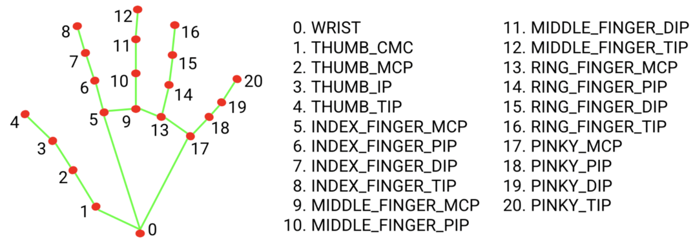

# The Code

The basic premise of this project was to control something by hand gestures. 
The easiest way to implement this kind of interaction is by using Google's framework [mediapipe](https://developers.google.com/mediapipe) created primarily for Python.
Mediapipe contains a lot of computer vision models for all kinds of purposes and one of them is Hand Tracking. Using two modules at the backend (Palm Detection and Hand Landmarks),
the Hand Tracking crops the given image so that only one hand is visible, adding landmarks afterwards.
This is useful for triggering events based on the position of hands on the screen, as well as relative position of fingers.



The easiest way to implement mediapipe is by using [PyCharm IDE](https://www.jetbrains.com/pycharm/), which enables a simple installation of all available packages with a few clicks. This requires usage of OpenCV library as well.
After typing the basic lines of code to display the webcam, Hands module must be implemented.
It requires four parameters:
* static_image_mode (default: False)
* max_num_hands (default: 2)
* min_detection_confidence (default: 0.5)
* min_tracking_confidence (0.5).

The first parameter determines wheter the module detects or tracks hands on the image. This choice depends on the tracking confidence level:
low level equals detection, high level equals tracking. Thresholds for detection and tracking are set up with min_detection_confidence and min_tracking_confidence.
The code snippet below displays detected landmarks:

```python

import cv2
import mediapipe as mp
import time

cap = cv2.VideoCapture(0)

mpHands = mp.solutions.hands
hands = mpHands.Hands()		# static_image_mode (default: False), max_num_hands (default: 2), min_detection_confidence (default: 0.5) and min_tracking_confidence (0.5)
mpDraw = mp.solutions.drawing_utils

while True:
	success, img = cap.read()
	imgRGB = cv2.cvtColor(img, cv2.COLOR_BG2RGB)	# mediapipe requires RGB image as input
	results = hands.proces(imgRGB)

	if results.multi_hand_landmarks:	# if landmark is detected, draw each landmark as well as connections between them 
		for handLms results.multi_hand_landmarks:
			for id, lm in enumerate (handLms.landmark):	# calculate position of each landmark using size of camera
				h, w, c = img.shape
				cx, cy = int(lm.x * w),  int(lm.y * h)

			mpDraw.draw_landmarks(img, handLms, mpHands.HAND_CONNECTIONS)
			
 
     	cv2.imshow("Screen", img)
	cv2.waitKey(1)
```
To make this algorithm available for other programs, this simple snippet needs to be written in a form of a class. After proper rearrangement, the code now looks like this:

```python

import cv2
import mediapipe as mp
import time

class handDetector():
	def __init__(self, mode = False, maxHands = 2, detectionCon = 0.5, trackCon = 0.5):
		self.mode = mode
		self.maxHands = maxHands
		self.detectionCon = detectionCon
		self.trackCon = trackCon
		
		self.mpHands = mp.solutions.hands
		self.hands = self.mpHands.Hands()
		self.mpDraw = mp.solutions.drawing_utils
		
	def findHands(self, img, draw = True):													
		imgRGB = cv2.cvtColor(img, cv2.COLOR_BGR2RGB)	# mediapipe works only with RGB images
		self.results = hands.process(imgRGB)	# algorithm implementation
	
		if results.multi_hand_landmarks:	# iterate through detected landmarks
			for handLms in self.results.multi_hand_landmarks:
				if draw:			
					self.mpDraw.draw_landmarks(img, handLms, mpHands.HANDS_CONNECTIONS)		# displays original BGR image with the handmark layer
				
		return img
		
	def findPosition(self, img, HandNo=0, draw = True):
	
		lmList = []
		
		if self.results.multi_hand_landmarks:
		
			myHand = self.results.multi_hand_landmarks[handNo]
		
			for id, lm in enumerate(handLms.landmark):
				h, w, c = img.shape()
				cx, cy = int(lm.x * w), int(lm.y * h)	# calculating x and y coordinates of each landmark using image dimensions
				lmList.append([id, cx, cy])

		return lmList
		

	
	
def main():
	cap = cv2.VideoCapture(0)
	detector = handDetector()
	
	while True:
		success, img = cap.read()
		img = detector.findHands(img)
		lmList = detector.findPosition(img)
		
		cv2.imshow("Screen", img)
		cv2.waitKey(1)
		
if __name__ == "__main__":
	main()
	
```

By this point the code doesn't do much except drawing a very crude outline of hands. To put Google's research to good use, we need to utilize its function.

One of the most basic signals we humans can do with our hands is pointing fingers. Another well known signal we humans tend to produce is a closed fist, often times representing something bad is about to happen to the observer.
In light of these observations I decided to intepret raised finger as a positive and lowered (folded) finger as negative. Consulting the landmark diagram, it is obvious that the y coordinate of the tip of the finger is positioned higher than the other parts of the finger.
The opposite is true for the folded finger: the tip is positioned lower than other parts.

By comparing coordinates of the tip with some other part of the same finger it is possible to control the value of variables using fingers as input.
In this project each finger is represented by a variable with two possible states: raised (1) or lowered (0). These variables are then stored into a list for improved readability.
This thought process is realized with the following code:

```python

import cv2
import time
import HandTrackingModule as htm

detector = htm.handDetector()
tipIDs = [4, 8, 12, 16, 20]		# IDs of fingertips

while 1:
	success, img = cap.read()
	img = detector.finHands(img)
	lmList = detector.findPosition(img, draw = False)	# store position of each landmark in lmList
	
	if len(lmList) != 0:
		fingers = []

   		if lmList[tipIDs[0]][1] > lmList[tipIDs[0]-1][1]:	# thumb is positioned horizontally, therefore x coordinates are compared
   			fingers.append(1)
   		else:
   			fingers.append(0)
   			
   		for id in range(1,5):	#iterate through rest of fingers	# rest of the fingers are positioned vertically, which requires copmarison of y coordinates with lower parts of fingers
   			if lmList[tipIDs[id]][2] < lmList[tipIDs[id]-2][2]:
   				fingers.append(1)
   			else:
   				fingers.append(0)
   				
   				
   	if fingers:
   		#DO SOMETHING

```

The final version of the code contains a list called fingers, which stores information of each fingers' state.
If a finger is raised, the corresponding value is 1, otherwise it is 0. This can be used to control up to five different parameters with only one hand.
