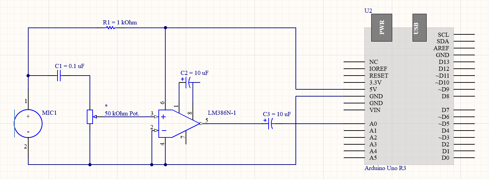
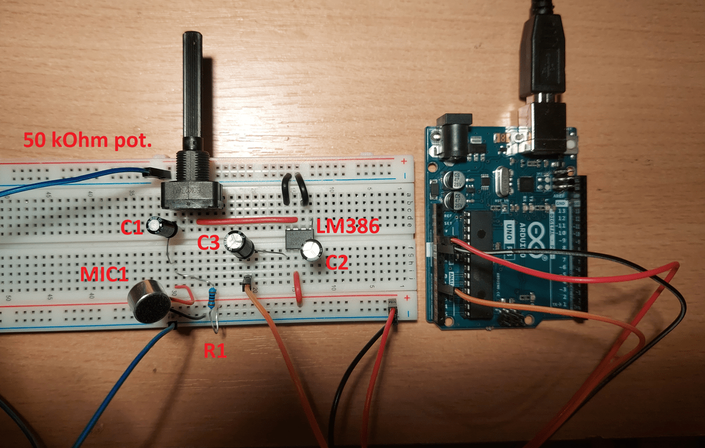
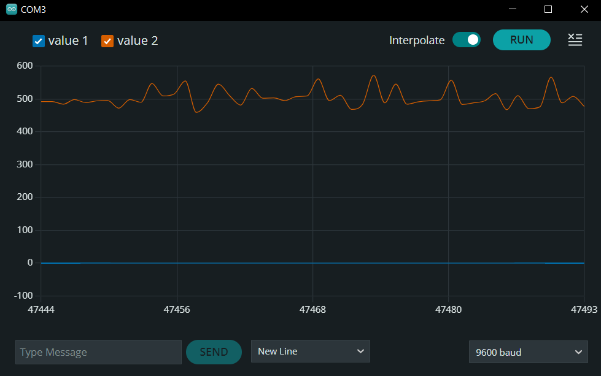
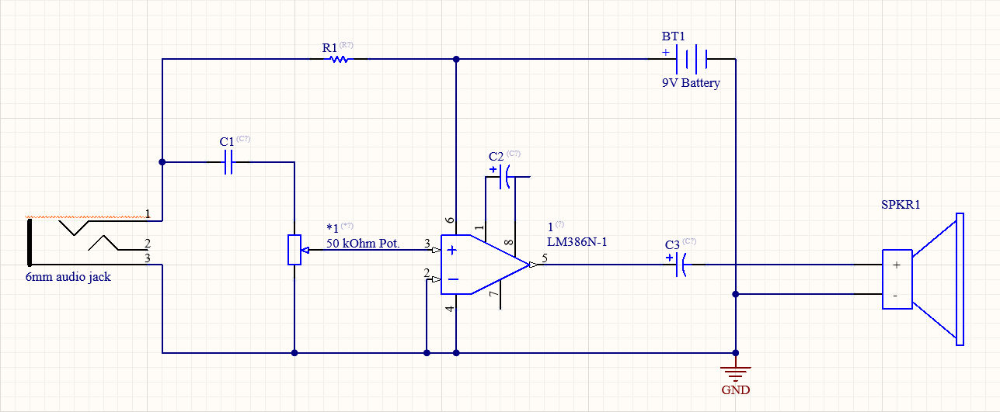

# Sound detection

*"A good bell is heard from afar, a bad one still further"*

While this might be true for bells and us humans, this proverb fell on deaf ears when it comes to sound detection.

This project demonstrates a basic circuit using a microphone and OP-amp alongside few passive components and as such can be used as the basis for frequency analysis and all sorts of sound detection projects.

## The Project

The very mention of sound detection implies usage of microphones, types of transducers which convert sound to electric signal. Not only is the output signal very weak even for nearby sources of sound, but it also contains noise. For this reason the LM386 amplifier is conected to the mic with electrolytic capacitors which filter out unwanted noise. The schematic below shows one way of achieving amplification of filtered signal.




Capacitor C2 is added to further increase the amplification of the signal. This is more-or-less neccessary for any practical use.

Below is a simple code used to display the signal, along with a plotted output.

```c
void setup() {

  Serial.begin(9600);
}

void loop() {
  //int a0 = analogRead(A0);
  int a1 = analogRead(A1);
  Serial.print(0);
  //Serial.print(",");
  //Serial.println(a0);
  Serial.print(",");
  Serial.println(a1);
  delay(1);
}
```



## Workshop experience

Just as I was finishing this project I stumbled upon a *completely free* workshop in my area. It was the final segment of DIY workshops in which all attendees got to solder their own speaker with 6mm audio jack as input.
The workshop, held by Tin Dožić in [MaMa - Multimedia Institute](https://mi2.hr/), provided free materials identical to the components I used. Instead of breadboard, parts were assembled and soldered on a stripboard, so every atendee went out with a fixed smile and equally fixed components.




This speaker can be used to play music from a cell phone or as a guitar amp. If you have no idea what to do with, let me give you a *hand* with *detecting* your capabilities.
