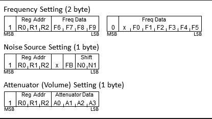
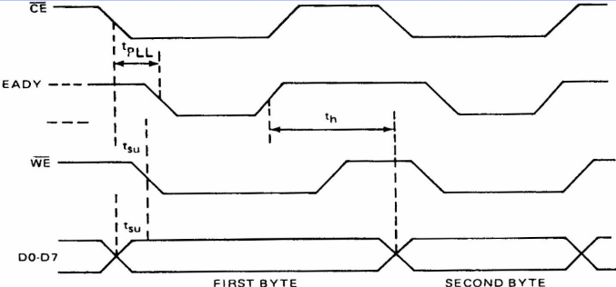

# Introduction

Spring of 2022. The terror of exam weeks has ended just a few days ago. Best time of the year to replace the nervous silence of classroom with tinitus caused by the roaring instruments of unknown local band.
Still unable to forget technical terms used in exams, my friend and I enter through the door and decide to soak in the atmosphere of the place in which a rehersal takes place. One of us notices the struggle a sound engineer has to endure to get the sound of the instruments just right. So many buttons, so little time. Imagine if he could wave his hands like a conductor of a grand orchestra to make things funnier and less efficient. That would actually be funny.

It's almost Spring of 2024. My post-concert tinitus is replaced with deafening silence of desk job at an office. There is still one loud sound occupying my head, which says: "I FINALLY DID THE FUNNY CONDUCTOR THING".

This is my original project. I am very proud to say that I haven't found anything similar on the web nor relied on other peoples' concepts, and as such this project allows me to present my personality and way of thinking. It took long hours of unguided thinking, imagining and waiting to set every detail right. If you find something similar, it's probably a project of the guy I was talking to back in 2022 and he ripped my idea.

# The Code

The basic premise of this project was to control something by hand gestures. Years of SF movies are responsible for this. 
The easiest way to implement this kind of interaction is by using Google's framework mediapipe created primarily for Python.
Mediapipe contains a lot of computer vision models for all kinds of purposes and one of them is Hand Tracking. Using two modules at the backend (Palm Detection and Hand Landmarks),
the Hand Tracking crops the given image so that only one hand is visible, adding landmarks afterwards.
This is useful for triggering events based on the position of hands on the screen, as well as relative position of fingers.


The easiest way to implement mediapipe is by using PyCharm IDE, which enables a simple installation of all available packages with a few clicks. This necessitates usage of OpenCV library as well.
After typing the basic lines of code to display the webcam, Hands module must be implemented.
It requires four parameters: static_image_mode (default: False), max_num_hands (default: 2), min_detection_confidence (default: 0.5) and min_tracking_confidence (0.5).
The first parameter determines wheter the module detects or tracks hands on the image. This choice depends on the tracking confidence level:
low level equals detection, high level equals tracking. Thresholds for detection and tracking are set up with min_detection_confidence and min_tracking_confidence.
The code snippet below displays detected landmarks:

```python

import cv2
import mediapipe as mp
import time

cap = cv2.VideoCapture(0)

mpHands = mp.solutions.hands
hands = mpHands.Hands()		# static_image_mode (default: False), max_num_hands (default: 2), min_detection_confidence (default: 0.5) and min_tracking_confidence (0.5)
mpDraw = mp.solutions.drawing_utils

while True:
	success, img = cap.read()
	imgRGB = cv2.cvtColor(img, cv2.COLOR_BG2RGB)	# mediapipe requires RGB image as input
	results = hands.proces(imgRGB)

	if results.multi_hand_landmarks:	# if landmark is detected, draw each landmark as well as connections between them 
		for handLms results.multi_hand_landmarks:
			for id, lm in enumerate (handLms.landmark):	# calculate position of each landmark using size of camera
				h, w, c = img.shape
				cx, cy = int(lm.x * w),  int(lm.y * h)

			mpDraw.draw_landmarks(img, handLms, mpHands.HAND_CONNECTIONS)
			
 
     	cv2.imshow("Screen", img)
	cv2.waitKey(1)
```
To make this code accessible, this simple snippets needs to be written in a form of a class. After proper rearrangement, the code now looks like this:

```python

import cv2
import mediapipe as mp
import time

class handDetector():
	def __init__(self, mode = False, maxHands = 2, detectionCon = 0.5, trackCon = 0.5):
		self.mode = mode
		self.maxHands = maxHands
		self.detectionCon = detectionCon
		self.trackCon = trackCon
		
		self.mpHands = mp.solutions.hands
		self.hands = self.mpHands.Hands()
		self.mpDraw = mp.solutions.drawing_utils
		
	def findHands(self, img, draw = True):													
		imgRGB = cv2.cvtColor(img, cv2.COLOR_BGR2RGB)										# mediapipe works only with RGB images
		self.results = hands.process(imgRGB)												# algorithm implementation
	
		if results.multi_hand_landmarks:													# iterate through detected landmarks
			for handLms in self.results.multi_hand_landmarks:
				if draw:			
					self.mpDraw.draw_landmarks(img, handLms, mpHands.HANDS_CONNECTIONS)		# displays original BGR image with the handmark layer
				
		return img
		
	def findPosition(self, img, HandNo=0, draw = True):
	
		lmList = []
		
		if self.results.multi_hand_landmarks:
		
			myHand = self.results.multi_hand_landmarks[handNo]
		
			for id, lm in enumerate(handLms.landmark):
				h, w, c = img.shape()
				cx, cy = int(lm.x * w), int(lm.y * h)										# calculating x and y coordinates of each landmark using image dimensions
				lmList.append([id, cx, cy])

		return lmList
		

	
	
def main():
	cap = cv2.VideoCapture(0)
	detector = handDetector()
	
	while True:
		success, img = cap.read()
		img = detector.findHands(img)
		lmList = detector.findPosition(img)
		
		cv2.imshow("Screen", img)
		cv2.waitKey(1)
		
if __name__ == "__main__":
	main()
	
```

By this point the code doesn't do much except drawing  a very crude outline of hands. To put Google's research to good use, we need utilize its function.
One of the most basic signals we humans can do with our hands is pointing fingers. Another well known signal we humans tend to produce is a closed fist, often times representing something bad is about to happen to the observer.
In light of these observations I decided to intepret raised finger as a positive and lowered (folded) finger as negative. Consulting the landmark diagram, it is obvious that the y coordinate of the tip of the finger is positioned higher than the other parts of the finger. The opposite is true for the folded finger: the tip is positioned lower than other parts. By comparing coordinates of the tip with some other part of the same finger it is possible to control the value of variables using fingers as input. In this project each finger is represented by a variable with two possible states: raised (1) or lowered (0). These variables are then stored into a list for improved readability.
This thought process is realized with the following code:

```python

import cv2
import time
import HandTrackingModule as htm

detector = htm.handDetector()
tipIDs = [4, 8, 12, 16, 20]

while 1:
	success, img = cap.read()
	img = detector.finHands(img)
	lmList = detector.findPosition(img, draw = False)
	
	if len(lmList) != 0:
		fingers = []

   		if lmList[tipIDs[0]][1] > lmList[tipIDs[0]-1][1]:
   			fingers.append(1)
   		else:
   			fingers.append(0)
   			
   		for id in range(1,5):	#iterate through rest of fingers
   			if lmList[tipIDs[id]][2] < lmList[tipIDs[id]-2][2]:
   				fingers.append(1)
   			else:
   				fingers.append(0)

```

# PRELISTAJ NA 12:20

#SN76489

Barely larger than a raisin, this chip contains a whole decade of sound design and still refuses to leave in silence. It was made by Texas Instruments in 1979 and for the next 10 years it sat comfortably in cases of many home computers and arcade machines. This chip is a Digital Complex Sound Generator (DSCG) with 3 square wave tone generators and one noise generator. The three tone generators were used for melodies, while the noise channel found its use in simulating sounds of explosions or percussion.

## Pins
[SN76489 pins.](SN76489_pinout.png "SN76489 pins")

As shown in the image, the pins can be divided into these categories:

* input pins (D0-D7)
* audio out (pin 7)
* clk (pin 14)
* /WE (active low write enable, pin 5)
* VCC (pin 15)
* /CE (active low chip enable, pin 6)
* GND (pin 8)
* RDY (unused)

## Sending bytes

The frequency of the square waves produced by the tone generators on each channel is derived from two factors:
* the speed of the crystal oscillator
* value of desired frequency

or in form of equation:


where f is the desired frequency. This number must be translated to binary form.

The chip receives input from 8 digital pins, as well as from a 4 MHz crystal oscillator which powers its IC.
A microprocessor programs the IC by sending bytes of data from pins D0 - D7.
The bytes which can be sent to the chip are one of the two - either latched or data byte. 
* Latched bytes: Four significant bits carry the information about the desired channel, while the lower four bits store the first four bits of the number we calculated with the formula above
* Data bytes: 2 most significant bits are 0, while the rest contain last 5 bits of calculated number.

Once a latched byte is sent to the register, all subsequent data bytes will be applied to that register until another latch byte is sent.
 
Image below shows all possible values of bytes that can be interpreted by the microprocessor.



The data sheet of SN76489 provides a diagram which shows how to send bytes.
The basic process with this chip is that you set up a byte on the eight data pins, then briefly pulse the /WE pin low to tell the chip that the byte is ready.




## COMPOSER OR COMPILER?

In contrast to everything mentioned above, coding proves to be quite simple. All it takes is two functions and a copy-paste shortcut.
Pins are assigned in the setup function with pinMode() and data is sent with digitalWrite(). Sending bytes works the same way as sending one bit, only difference being that the same function must be called 8 times for every bit in the byte. It ends up looking like this:

(SendByte funkcija)

alternatively, you can show mercy to your copy and paste buttons by sending bits with a for loop instead:

```c

void putByte(byte b)
{
	int i = 1;
	int pins = {D0, D1, D2, D3, D4, D5, D6, D7};
	int bit = 1; 

	for(i; i < 8; i++)
	{
		digitalWrite(pins[i], (b&bit) ? HIGH, LOW);
		bit *= 2;
	}
}
```
Sending pulse to WE pin for sending:

```c

void sendByte(byte b)
{
	digitalWrite(WE, HIGH);
	putByte(b);
	digitalWrite(WE, LOW);
	delay(1);
	digitalWrite(WE, HIGH);
}

```

Many music teachers will tell you that melodies sound good precisely becuse of the silence between the notes. So to ascend to the next level of musical prowess a silencing function is added:
It basically sends latched bytes with address and 4-bit data regarding volume: higher number means lower volume.

```c

void SilenceAllChannels()
{
	SendByte(0x9F); //mute channel 0
	SendByte(0xBF);	//mute channel 1
	SendByte(0xDF);	//mute channel 2
	SendByte(0xFF);	//mute noise channel
}

```

Here is a simple Arduino sketch playing notes A, B and C:

(STAVI OBRAZLOŽENJE, KAKO SE DOBIJE BAJT, KAKO I ZAŠTO IZGLEDA LATCHED I DATA BYTE)
(OVDJE IDE KOD)

## Headers

# This is a Heading h1
## This is a Heading h2


```c
void setup() {

  Serial.begin(9600);
}

void loop() {
  //int a0 = analogRead(A0);
  int a1 = analogRead(A1);
  Serial.print(0);
  //Serial.print(",");
  //Serial.println(a0);
  Serial.print(",");
  Serial.println(a1);
  delay(1);
}
```
###### This is a Heading h6

## Emphasis

*This text will be italic*  
_This will also be italic_

**This text will be bold**  
__This will also be bold__

_You **can** combine them_

## Lists

### Unordered

* Item 1
* Item 2
* Item 2a
* Item 2b

### Ordered

1. Item 1
2. Item 2
3. Item 3
    1. Item 3a
    2. Item 3b

## Images


## Summary

> **What is this?**
>
>> Sound Detection circuit.
	
> **Is it useful?**
>
>> No, not by itself.
	
> **Why would I want do build one?**
>
>> You can make many other projects on top of this one to impress people coming from LinkedIn. Go and check my other projects on this repo to become inspired!    

## Links

You may be using [Markdown Live Preview](https://markdownlivepreview.com/).

## Blockquotes

> Markdown is a lightweight markup language with plain-text-formatting syntax, created in 2004 by John Gruber with Aaron Swartz.
>
>> Markdown is often used to format readme files, for writing messages in online discussion forums, and to create rich text using a plain text editor.

## Tables

| Left columns  | Right columns |
| ------------- |:-------------:|
| left foo      | right foo     |
| left bar      | right bar     |
| left baz      | right baz     |

## Blocks of code

```
let message = 'Hello world';
alert(message);
```

## Inline code

This web site is using `markedjs/marked`.

