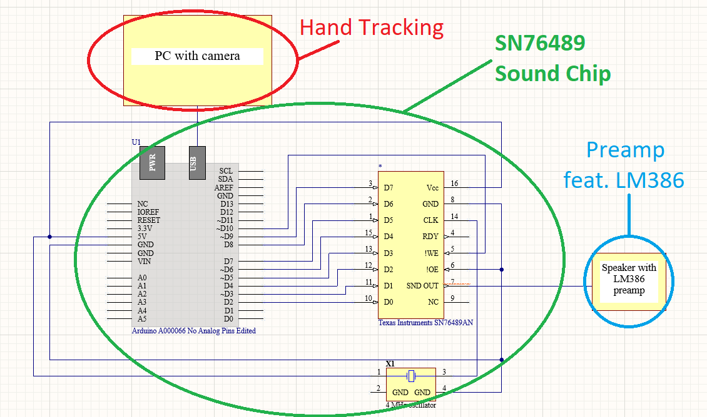

# Introduction

Spring of 2022. The terror of exam weeks has ended just a few days ago. Best time of the year to replace the nervous silence of classroom with tinitus caused by the roaring instruments of unknown local band.
Still unable to forget technical terms used in exams, my friend and I enter through the door and decide to soak in the atmosphere of the place in which a rehersal takes place. One of us notices the struggle a sound engineer has to endure to get the sound of the instruments just right. So many buttons, so little time.
Imagine if he could wave his hands like a conductor of a grand orchestra to make the whole process funnier and less efficient. That would actually be funny.

It's almost Spring of 2024. My post-concert tinitus is replaced with deafening silence of desk job at an office. As I get back home, the silence is suddenly interrupted with a loud retro sound: the first note of my project is played.
While not a exactly a literal interpretation of the modern age conductor I did something equally exciting. Using Arduino, SN76489 sound chip and Python with OpenCV and mediapipe libraries, I create a device which enables its user to play tunes using hand gstures.
I came up with the concept and practical solutions of this project by myself and used internet for guidance. Consulting multiple sources for each part of the project, I also learned their logic and behavior. This was neccessary since the final outcome of this project is something I came up with by myself and could not simply search for the solution elsewhere.
If you find something similar, it's probably a project of the guy I was talking to back in 2022.

The creation of this project requires a broad spectrun of STEM disciplines, such as computer vision programming, soldering, basics of electronics and looking for obscure error on Stack Overflow.  
I already have a few ideas to improve this project but most of all I would like to hear opinions from anyone else but me, since I've been arguing with myself for far too long. Feel free to contact me via gmail (lukab.uljan42@gmail.com).

