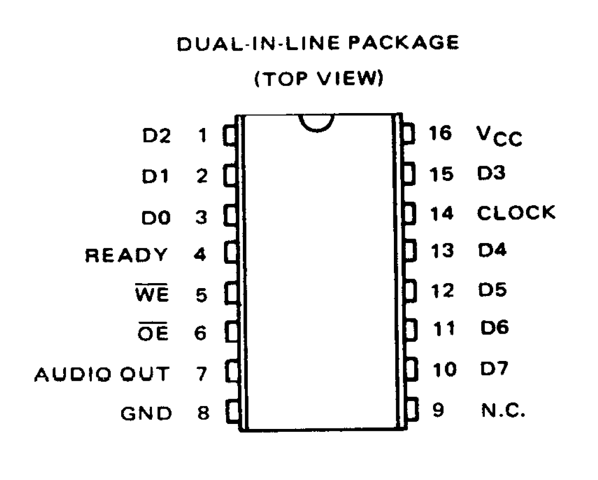
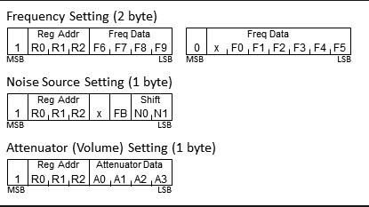
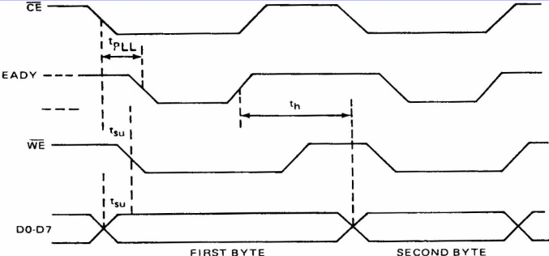

#SN76489

Barely larger than a raisin, this chip contains a whole decade of sound design and still refuses to leave in silence. It was made by Texas Instruments in 1979 and for the next 10 years it sat comfortably in cases of many home computers and arcade machines.
This chip is a Digital Complex Sound Generator (DSCG) with 3 square wave tone generators and one noise generator. The three tone generators were used for melodies, while the noise channel found its use in simulating sounds of explosions or percussion.

## Pins


As shown in the image, the pins can be divided into these categories:

* input pins (D0-D7)
* audio out (pin 7)
* clk (pin 14)
* /WE (active low write enable, pin 5)
* VCC (pin 15)
* /CE (active low chip enable, pin 6)
* GND (pin 8)
* RDY (unused)

## Sending bytes

The frequency of the square waves produced by the tone generators on each channel is derived from two factors:
* the speed of the crystal oscillator
* value of desired frequency

or in form of equation:


where f is the desired frequency. This number must be translated to binary form.

The chip receives input from 8 digital pins, as well as from a 4 MHz crystal oscillator which powers its IC (integrated circuit).
Arduino's microprocessor can be used to program the IC by sending bytes of data from pins D0 - D7.
The bytes which can be sent to the chip are one of the two - either latched or data byte. 
* Latched bytes: Four significant bits carry the information about the desired channel, while the lower four bits store the first four bits of the number calculated with the formula above
* Data bytes: 2 most significant bits are 0, while the rest contain last 6 bits of calculated number.

Once a latched byte is sent to the register, all subsequent data bytes will be applied to that register until another latch byte is sent.
 
Image below shows all possible values of bytes that can be interpreted by the microprocessor.



The data sheet of SN76489 provides a diagram which shows how to send bytes.
The basic process with this chip is that you set up a byte on the eight data pins, then briefly pulse the /WE pin low to tell the chip that the byte is ready.




## COMPOSER OR COMPILER?

In contrast to everything mentioned above, coding proves to be quite simple. All it takes is three functions.
Pins are assigned in the setup() function with pinMode() and data is sent with digitalWrite().
Sending bytes works the same way as sending one bit, only difference being that the same function must be called 8 times for every bit in the byte.
My solution to this was checking the value of each bit in a for loop. Checking is performed with *bitwise and operator* and a variable called *bit*, which is shifted to the left at the end of every loop to isolate and verify the value of each bit.
It ends up looking like this:

(SendByte funkcija)

```c

void putByte(byte b)
{
	int i = 1;
	int pins = {D0, D1, D2, D3, D4, D5, D6, D7};
	int bit = 1; 

	for(i; i < 8; i++)
	{
		digitalWrite(pins[i], (b&bit) ? HIGH, LOW);
		bit *= 2;
	}
}
```

Sending pulse to WE pin:

```c

void sendByte(byte b)
{
	digitalWrite(WE, HIGH);
	putByte(b);
	digitalWrite(WE, LOW);
	delay(1);
	digitalWrite(WE, HIGH);
}

```

Here is a simple Arduino sketch playing notes A, B and C:

In this example, I decided to continuously play C3 (128 Hz), E3 (165 Hz) and G3 (196 Hz).

### C3
* I increase the volume of channel 0 to maximum by sending 0x90
* using the formula for the frequency I got 919 or 1110010111 (result must be stored as an int variable)
* since I want to use channel 0 for this tone, first four bits are 1000 (0x8) while 4 least significant bits are 0111 (0x3).
* the remaining 6 are 111001. When padded with additional two zeros to form a data byte, I got 00111001 (0x39).
* this yields 0x83 as a latched and 0x39 as a data byte 

### E3
* I increase the volume of channel 1 to maximum by sending 0xB0
* Using the frequnecy formula I got 757 or 1011110101: 4 least significant bits form 0x5 while the remaining 6 padded with additional two zeros at the end form 0x2F 
* I want to play this tone at channel 1 (0xA), so my latched and data bytes are 0xA5 and 0x2F

### G3
* I increase the volume of channel 2 to maximum by sending 0xD0
* Using the frequnecy formula I got 637 or 1001111101: 4 least significant bits form 0xD while the remaining 6 padded with additional two zeros at the end form 0x27
* I want to play this tone at channel 2 (0xC), so my latched and data bytes are 0xCD and 0x27

This is how the Arduino sketch version of this thought process looks like:
(OVDJE IDE KOD)
