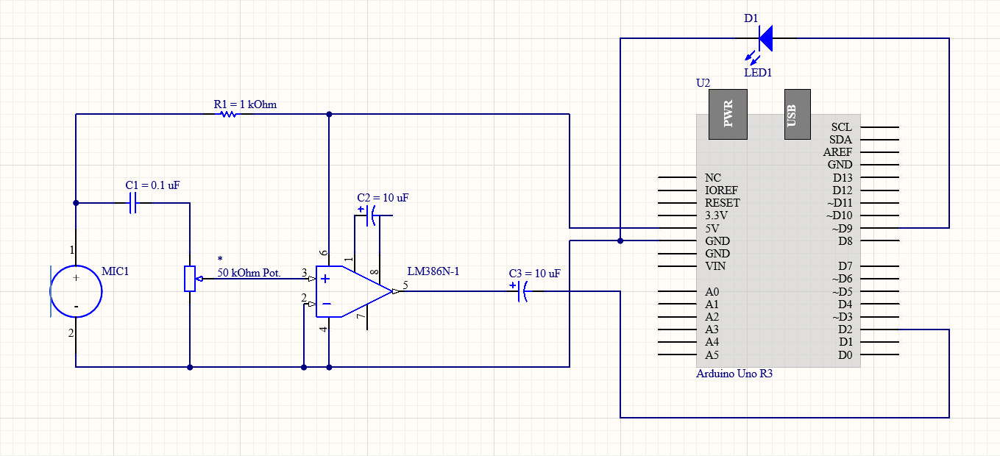

# Clap Switch

The first clap switch available to the public was invented exactly 40 years ago, so if you go back to 80s and show this project to everyone you would be considered a genius 
In comparison to the sound detection circuit, this one only requires an additional resistor and an LED diode, but also features a significant step-up in terms of coding complexity.
What I mean is the real meat of this project lies within the code. With this project Arduino finally doesn't work as just an overhyped battery, but as a microcomputer as was intended.

Circuit diagram code segments are shown below. You can find the complete code at the bottom of this readme.   

## Headers

# This is a Heading h1
## Code explanation




```c
int mic = 2;       // microphone module
int indicLED = 13; // indication pin
int lightPin = 9;  // relay (lights control)
bool lightState = true;
bool ignoreInt = false;
bool ClapDetected = false;
uint32_t ClapDetetedTime [3] {};

void setup() {
  Serial.begin(115200);
  pinMode(indicLED, OUTPUT);    
  pinMode(lightPin, OUTPUT);  
  digitalWrite(lightPin, lightState);
  attachInterrupt(digitalPinToInterrupt(mic), ISR_ClapDetected, FALLING);
}
```
First thing to do is initialize pin numbers and boolean variables. Unlike standard reading of analog signals, digital pin number 2 is defined as input.
Reason for this is the *attachInterrupt* function, which requires either pin number 2 or 3 as an argument, which is converted to specific interrupt number with *digitalPinToInterrupt*. Each time a falling edge is detected on the signal, *ISR_ClapDetected* is called.
LED diode is controlled with pin 9 using Boolean variable lightState. Each time a certain condition is met, lightState variable turns to true and lights up the diode. Switching to false turns off the diode.
Bool variable clapDetected is used at a later segment of the code.  

```c
void ISR_ClapDetected()
{
  if(millis() - ClapDetetedTime[2] > 200){ // debounce

  for (int i = 0; i != 2; i++) {
  ClapDetetedTime[i] = ClapDetetedTime[i + 1];
  }
  
  ClapDetetedTime[2] = millis();
  ClapDetected = true;
  Serial.println("clap detected");
  digitalWrite(indicLED, HIGH);
  }
}
```
This function reacts to the sound of clapping and fills the *ClapDetectedTime* array with values which represent time at which a falling edge is detected. 
Since this array can hold only 3 values, every 200 miliseconds the values are updated so that the earlier detections are on a lower index.
The third value is always the newest clap detected.
```c
void loop() {
delay(2);

int d2 = digitalRead(mic);

if(millis() - ClapDetetedTime[2] >= 800)
{
  digitalWrite(indicLED, LOW);
}

if(millis() - ClapDetetedTime[2] < 800 && millis() - ClapDetetedTime[1] < 800 && ClapDetected && ClapDetetedTime[1] - ClapDetetedTime[0]>=800)
  {
    Serial.println("double clap detected");
    digitalWrite(indicLED, LOW);
    Serial.print("Setting light to ");
    Serial.println(String(!lightState));
    digitalWrite(lightPin, lightState);
    lightState=!lightState;
    ClapDetected = false;
  }
}
```
The main part of this code is used for reading values from pin 2 and switching on the LED diode if a double clap is detected. Detection is successful if time between two claps is less than 800 miliseconds.
the if statement also takes time between the third and second newest clap into account. This is done so as to filter out switching when there are more than two consecutive claps detected at a short interval.
When the condition are met, the value of lightState is inverted. This way the diode switches on if it was turned off and vice versa.

###### This is a Heading h6

## Emphasis

*This text will be italic*  
_This will also be italic_

**This text will be bold**  
__This will also be bold__

_You **can** combine them_

## Lists

### Unordered

* Item 1
* Item 2
* Item 2a
* Item 2b

### Ordered

1. Item 1
2. Item 2
3. Item 3
    1. Item 3a
    2. Item 3b

## Images


## Summary

> **What is this?**
>
>> Sound Detection circuit.
